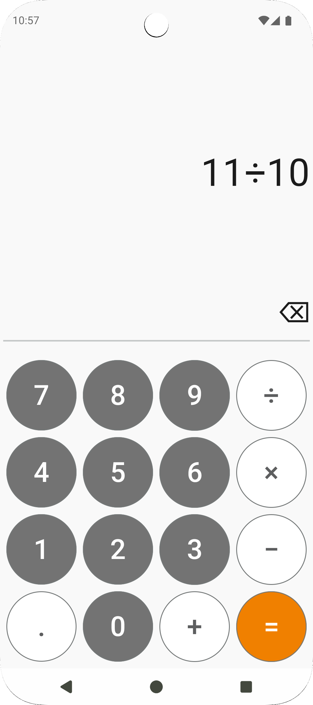
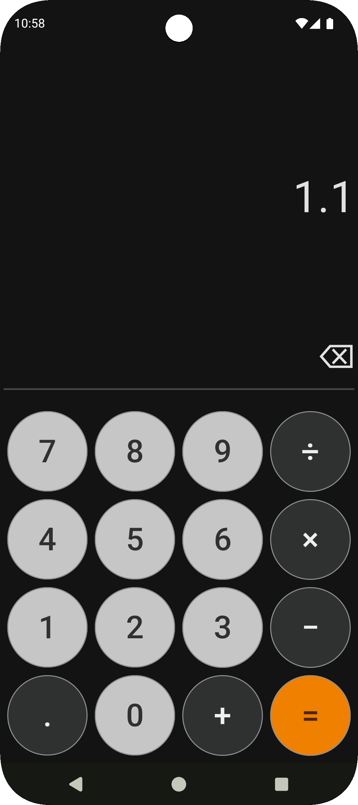

# Simple & Stylish Calculator for Android

[](https://kotlinlang.org/) [](LICENSE)

A modern calculator app built with **Jetpack Compose** and a clean **MVVM architecture**. It features a stylish, user-friendly interface with a custom **Material 3 theme** that supports both light and dark modes.

## 📸 Screenshots

|                   Light Mode                    |                   Dark Mode                   |
|:-----------------------------------------------:|:---------------------------------------------:|
|  |  |

## ✨ Features

-   **Standard Arithmetic:** Supports all basic operations (`+`, `-`, `×`, `÷`).
-   **Decimal Support:** Full functionality for calculations with decimal numbers.
-   **Smart Backspace:** Tap to delete the last character or long-press to clear all input.
-   **Adaptive Theme:** Automatically switches between custom light and dark themes.

## 🛠 Tech Stack & Architecture

-   **UI:** 100% **Jetpack Compose** for a modern, declarative UI.
-   **Architecture:** Clean **MVVM** (Model-View-ViewModel) to ensure a scalable and maintainable codebase.
-   **Theming:** Custom **Material 3** theme generated with the Material Theme Builder.
-   **Language:** Written entirely in **Kotlin**.

## 🚀 Build & Run

### Prerequisites

-   Android Studio (latest stable version)
-   JDK 17 or higher

### Installation

1.  **Clone the repository:**
    ```sh
    git clone [https://github.com/your-username/your-repo-name.git](https://github.com/your-username/your-repo-name.git)
    ```
2.  **Open in Android Studio:**
    -   Open the project in Android Studio.
    -   Let Gradle sync all the project dependencies.
3.  **Run the app:**
    -   Select an emulator or a physical device.
    -   Click the "Run" button.

## 📄 License

This project is licensed under the **MIT License**. See the [LICENSE](LICENSE) file for details.